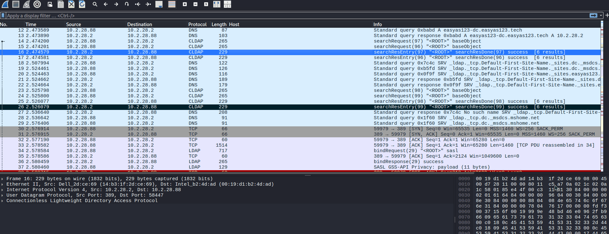

# Network Threat Hunting & Malware PCAP Analysis Lab

[](https://www.kali.org/)
[](#-tooling--technology-stack)

A hands-on network forensics and threat hunting repository documenting 8 comprehensive security incident investigations based on full-packet captures (PCAPs) from [Malware-Traffic-Analysis.net](https://www.malware-traffic-analysis.net/).

This project illustrates real-world SOC Level 2 / DFIR playbooks, protocol dissections, triage pipelines, and Active Directory identity mapping under Linux environments.

<p align="center">
  
</p>

---

## 🧭 Project Overview

When investigating network-level intrusions, standard log analysis often fails to expose the complete sequence of an intrusion. This lab focuses on deep packet inspection (DPI), protocol reassembly, and threat hunting workflows directly from raw network traffic (`.pcap`) across diverse internal Active Directory corporate architectures.

### Key Objectives
* **Subnet & Endpoint Triage:** Rapidly segmenting local subnets (`/24`), filtering domain infrastructure (Domain Controllers, Gateways, DNS servers), and isolating infected workstations.
* **Identity Profiling in Active Directory:** Resolving victim attributes without waiting for administrative logs by parsing raw **Kerberos (`AS-REQ`/`CNameString`)**, **NetBIOS (NBNS)**, and **DCE/RPC (`SAMR samr_UserInfo21`)** structures.
* **C2 Architecture & Beacon Detection:** Identifying and dissecting unencrypted Command and Control channels, cleartext HTTP tunneling over port 443, obfuscated URI parameters, and periodic beacon intervals.
* **IDS Alert Correlation:** Parsing and cross-referencing pre-generated Suricata / Emerging Threats (ET) rule logs with raw packet bytes to confirm malware families, threat classifications, and C2 check-ins.

---

## 🛠️ Tooling & Technology Stack

| Tool | Core Application in this Lab |
| :--- | :--- |
| **Wireshark** | Deep packet analysis, TCP stream inspection, protocol hierarchy evaluation, and RPC/SAMR field parsing. |
| **Tshark** | Scriptable command-line packet extraction, custom field parsing (`-T fields -e ...`), and rapid forensic triage. |
| **Zeek (Bro)** | Connection protocol metadata generation (`conn.log`, `http.log`, `kerberos.log`, `ssl.log`, `files.log`). |
| **Zui (Zed Engine)** | High-throughput structured querying and correlation of Zeek log datasets using pipeline expressions. |
| **NetworkMiner** | Network Forensic Analysis Tool (NFAT) deployed via Mono runtime for automated credential and host OS extraction. |
| **Suricata / Snort (Alert Logs)** | Reviewing and correlating Emerging Threats (ET) signature alerts against reassembled network streams for rapid threat classification. |

---

## 📁 Repository Structure

```text
Network-Threat-Hunting-Pcaps/
├── README.md
├── docs/
│   ├── methodologies-and-cheatsheet.md     # In-depth forensic methodology and query reference
│   └── tools-setup-and-workflows.md       # Environment setup, Mono workarounds, and tool usage
└── investigations/
    ├── 01-clickfix-c2-overhands.md        # ClickFix social engineering & C2
    ├── 02-formbook-infostealer-firsttolast.md # FormBook decoy check-ins & parameters
    ├── 03-netsupport-rat-easyas123.md     # NetSupport RAT HTTP beaconing
    ├── 04-lumma-stealer-win11office.md    # Lumma Stealer API telemetry exfiltration
    ├── 05-fake-microsoft-cloudflare-tunnels.md # Typosquatting C2 & Cloudflare tunnels
    ├── 06-malvertising-teamviewer-powershell.md # Fake software download & RAT staging
    ├── 07-netsupport-zphp-nemotodes.md    # FakeUpdates (ZPHP) & HTTP on port 443
    └── 08-koi-stealer-bepositive.md       # Win32/Koi Stealer direct-to-IP beaconing

```

---

## ⚠️ Disclaimer

All PCAP datasets and malware indicators analyzed in this repository were sourced from benign, publicly available security research scenarios provided by [Malware-Traffic-Analysis.net](https://www.malware-traffic-analysis.net/). These workflows are published strictly for educational, defensive security, threat hunting, and digital forensics research purposes.